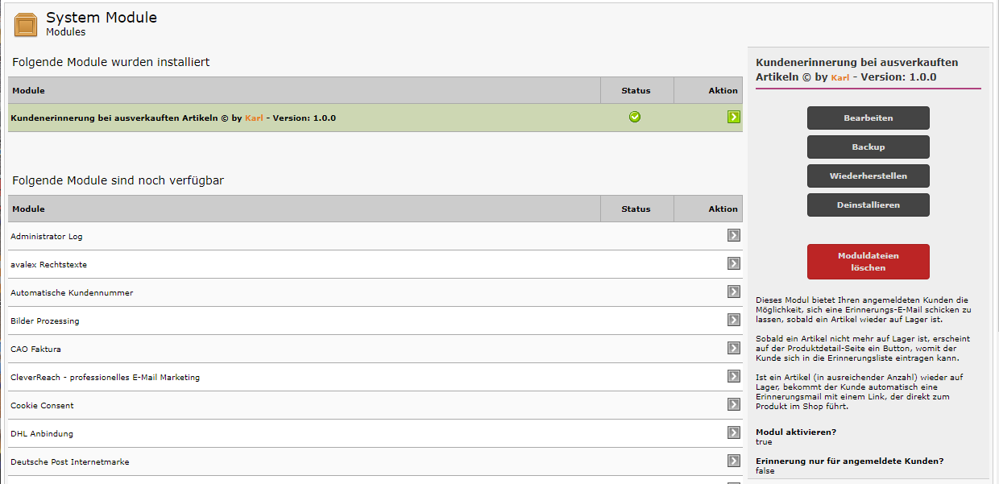

#	Module Kundenerinnerung mit Opt-in

## Beschreibung

#### Neuerung:  Der Kunde muss ein Opt-in-Verfahren durchlaufen bevor er Warenverfügbarkeitsnachrichten erhalten kann. Das Verfahren ist analog zum Opt-in-System für Newsletter.

Dieses Systemmodul bietet Ihren Kunden die Möglichkeit, sich eine Erinnerungs-E-Mail schicken zu lassen, sobald ein Artikel wieder auf Lager ist.
 
Sobald ein Artikel nicht mehr auf Lager ist, erscheint auf der Produktdetail-Seite ein Button, womit der Kunde sich in die Erinnerungsliste eintragen kann.
 
Ist ein Artikel (in ausreichender Anzahl) wieder auf Lager, bekommt der Kunde automatisch eine Erinnerungsmail mit einem Link, der direkt zum Produkt im Shop führt.

Anmerkung: Der Mailversand wird angestoßen, sobald eine Seite im Shop neu geladen wird.
 Aus Performance-Gründen werden Erinnerungsmails nur einmal täglich versandt.
 Wer den Versand sofort testen möchte, muss (z.B. mit phpMyAdmin) in der Datenbanktabelle "simulated_cron_records" nach der Zeile "customers_remind" suchen und das Datum in der Spalte "last_executed" zurücksetzen - anschließend eine Seite im Shop neu laden.
 
 Soll bei jedem Seitenaufruf die Tabelle "Kundenerinnerung" mit dem "Lagerbestand" abgeglichen werden und der Mailversand gestartet werden,
 dann die Datei /includes/modules/customers_remind.php mit einem Editor öffnen und in Zeile 19 den Wert ändern in
 $sendmail_asap = true;
 
Wenn das Modul installiert und aktiviert ist, wird der Warenkorb-Button überschrieben, sobald der Hauptartikel nicht mehr auf Lager ist.
 Weil der Warenkorb-Button nur überschrieben wird, sind keine Änderungen im Template erforderlich.

Im Paket enthalten sind Dateien für die Templates
- tpl_modified_nova
- tpl_modified_modified
- tpl_modified

## Installation

#### Wenn das Modul vorher schon installiert war, wegen des neu hinzugekommenen Opt-in-Verfahrens erforderlich, das alte Systemmodul zu deinstallieren.

1. BACKUP MACHEN!!!

2. Dateien in den Shop kopieren (es wird nichts überschrieben)
   Hinweis: Der Name des Ordners "admin" muss an den des Shops angepasst werden!

3. Im Adminbereich unter "Module->System Module" findet man jetzt den Eintrag "Kundenerinnerung bei ausverkauften Artikeln".
   Dieses Modul auswählen und installieren.

   Das Modul ist nun installiert und aktiviert.

   Wichtig: Durch Klick auf "Bearbeiten" die Einstellungen überprüfen!

   Der Schalter "Erinnerung nur für angemeldete Kunden?" steht auf "Nein".
   Wer diesen Dienst nur für angemeldete Kunden erlauben möchte, stellt diesen Schalter auf "Ja".

## Deinstallation

1. Im Adminbereich unter "Module->System Module" den Eintrag "Kundenerinnerung bei ausverkauften Artikeln" auswählen.

2. Modul deinstallieren
   Hinweis: Damit werden alle Datenbankeinträge, keine Dateien, gelöscht.

3. Wer auch die Dateien entfernen möchte kann den roten Button "Moduldateien löschen" klicken.

# Bootstrap5 für Modified Shop 3.x - freies responsive Template

#### Ab Version 1.1.0 steht ein zweites Template zur Auswahl. Das Template "bootstrap5a" hat wieder eine linke Spalte mit Menü. Unterkategorien werden per Ajax nachgeladen.

 

Das Template basiert auf dem Bootstrap-Framework 5 und wird getestet mit der, zum Zeitpunkt des Erscheinens eines neuen Releases, aktuellen Shopversion.

## Eigenschaften:
- responsive Template für PC, Tablet, Smartphone
- zentrales Dropdown- / Megamenü für alle Artikel
- Bilderslider auf der Startseite, im Banner-Manager befüllbar
- Startseitenartikel als Slider
- Farbbänder/Ribbons Top, Neu, Angebot
- keine Core-Änderungen nötig
- Kategorielisting (Hauptkategorien) auf Startseite (schaltbar in BS5-Konfiguration Tab "Ansichten")
- Banner Manager für Bootstrap Slider - Banner können Kategorien zugewiesen werden. 
  Jede Kategorie kann eigene Slidereinstellungen erhalten.

Vorschaubilder sind im Verzeichnis *images/* zu finden

## Systemmodul "Bootstrap 5 Template Manager"

Sobald das Systemmodul installiert ist stehen unter dem Menüpunkt **Erw. Konfiguration - Bootstrap 5 Template Manager** zahlreiche Einstellmöglichkeiten zur Verfügung.

Im Paket enthalten sind die **Module**
	- Kundenerinnerung für vorübergehend nichtverfügbare Artikel
	- Billiger gesehen?
	- Frage zum Artikel?
	- Attributauswahl als Pflichtfeld und vorbelegt mit "Bitte wählen"
	- Automatische Preisberechnung bei Attributen
	- AGI: Anzahl im Warenkorb reduzieren
	- Awids Rating Breakdown - Rezensionsaufgliederung nach vergebenen Sternen

*Diese Module sind im Template Manager zuschaltbar.*

## Installation

- Vor jeder Änderung sollte ein Backup gemacht werden!
- Die Dateien aus dem Ordner **new_files/** in den Shop kopieren (evtl. muss der Name des Admin-Ordners vorher angepasst werden).
- Im Adminbereich **Konfiguration->Mein Shop** das Template auswählen.
- Zur Nutzung des Template Managers im Adminbereich **Module->System Module** den *Bootstrap 5 Template Manager* installieren.

## Update Template Manager

Voraussetzung: Dateien sind aktuell - System Modul "Bootstrap 5 Template-Manager" installiert.

- Zur Nutzung neuer Funktionen des Template Managers muss im Adminbereich **Module->System Module** der **Bootstrap 5 Template-Manager** ausgewählt werden.
- Anschließend den Button **Update** klicken und Update ausführen.

*Hinweis: Die bisher gemachten Einstellungen werden nicht überschrieben, es werden nur neue Funktionen mit den Standardwerten hinzugefügt. 

## BS5 Theme-Einstellungen (Kurzanleitung)

Hier können bestehende Theme-Vorlagen geladen, verändert und kompiliert werden.
Installiert ist ein PHP-basierter Sass-Compiler, der Bootstrap-Sass-Variablen in eine CSS-Datei umwandelt.
Mit wenigen Änderungen ist ein komplett verändertes Aussehen zu schaffen.

- Pfad zum BS5 Template wählen
- Pfad zum BS5 Theme wählen z.B. "eigenes Theme 1" - "Aktualisieren" drücken
- Tab "eigenes Theme 1" - Vorlage wählen und Button "Vorlage laden" klicken => Vorschau wird geladen
- Änderungen machen und "Aktualisieren"
- Zurück zu Tab "Allgemeines" und "Fertig - Theme ins Template übernehmen" klicken
- Caches löschen und Shop Frontend aktualisieren

## BS5 Banner Manager
Unter dem Menüpunkt **Erw. Konfiguration - Bootstrap 5 Template Manager** ist der **BS5 Banner Manager** zu finden. 
Für den Bootstrap Slider - können den Kategorien Banner zugewiesen werden. Zudem kann jede Kategorie eigene Slidereinstellungen erhalten.

## Umbenennen des Templates

- Den Ordner "bootstrap5" einfach ändern.
- Im Adminbereich **Konfiguration->Mein Shop** das Template auswählen.

*Im Template Manager gemachte Einstellungen bleiben unverändert.*

  

### Sollten Sie mit einem Problem nicht weiter kommen, finden sich bestimmt Helfer im Modified-Forum

### [Thema: TEMPLATE: Bootstrap5 für Shop 3.x - freies responsive Template](https://www.modified-shop.org/forum/index.php?topic=43328.0)

  

Viel Spaß! 
Karl 

